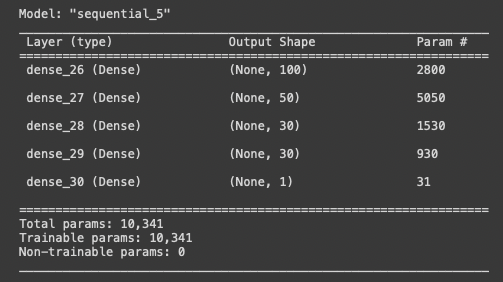

# Neural Network Charity Analysis Overview

Alpahbet Soup takes funds charity activities and has a preexisting data set with metadata about organizations who have received funds and if they were used effectively.  The goal of this project is to determine if a model can be built to accurately predict if an organization will use funds effectively based on the metadata provided, specifically to 75% accuracy. 

# Data Processing

The original data contains 12 columns.  The target variable is the 'IS_SUCCESSFUL' column, which shows if the organization successfully used the funds.  

The features used in the final model are:
- APPLICATION_TYPE
- AFFILIATION
- CLASSIFICATION 
- USE_CASE
- ORGANIZATION

The variables removed form the data are:
- SPECIAL_CONSIDERATIONS
- ASK_AMT
- EIN
- NAME
- STATUS
- INCOME_AMT

# Results
The final model achieves 69.4% accuracy on the test data, using a neural network with 4 hidden layers plus the output layer. The model employes a total of 211 neurons, arranged in the four layers 100 - 50 - 30 - 30 plus a single neuron for the output layer.  A variety of combinations of layers and neuron counts were run and models with 3 or 4 layers performed the best at fitting test data.

The 69% accuracy falls short of the desired accuracy of 75% despite many attempts to improve the model.  

It is possible that a random forest classifier will achieve better performance than the neural network.  If nothing else, the model will be more interpretable than the neural network.
